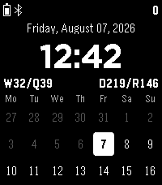

# Weekface

A Pebble Time 2 watchface built around how weeks structure a year: the time and full date,
the current ISO week and its quarter-end week, day-of-year progress, and a three-week
calendar — with the status bar (battery, bluetooth, steps) on top.



## Layout

Top to bottom:

| Row | Content |
|---|---|
| Status bar | Battery icon (red ≤20%, green charging) · Bluetooth icon (visible while connected) · step count (`821`, `10.2k`) |
| Date | `Friday, August 07, 2026` (weekday/month styles configurable) |
| Time | `12:42` — 12-hour, 24-hour, or military (`1242`) |
| Indicators | `W32/Q39` — ISO week / closing week of its fixed 13-week quarter · `D219/R146` — day of year / days remaining |
| Calendar | 3 weeks (previous, current, next), Monday-first, past days dimmed, today highlighted |

During timeline Quick View the calendar hides so everything else stays fully visible; it
returns when the Quick View dismisses.

## Settings

Configured from the Pebble phone app (Clay-generated page):

- **Time format** — 12-hour, 24-hour, or military
- **Display** — weekday full/abbreviated/hidden, month full/abbreviated, and individual
  toggles for each indicator value (week, quarter-end, day of year, days remaining)
- **Vibration** — on the hour, on connect/disconnect (both respect Quiet Time)
- **Translations** — every weekday, month (full + abbreviated), and the four indicator
  letters (W/Q/D/R) can be renamed; abbreviated weekday names also label the calendar
  columns (first two characters, UTF-8-aware)

Settings persist on the watch.

## Building

Requirements: [pebble-tool](https://developer.repebble.com/sdk/) ≥ 5.0.38, SDK 4.17, node.

```sh
pebble sdk install latest   # once
pebble build
```

## Running in the emulator

```sh
pebble install --emulator emery       # build + run on the Pebble Time 2 emulator
pebble screenshot --emulator emery out.png
pebble emu-app-config --emulator emery          # open the settings page in a browser
pebble emu-battery --percent 15 --emulator emery
pebble emu-bt-connection --connected no --emulator emery
pebble kill                            # stop emulators
```

`emery` is the Pebble Time 2 (200×228 color). The layout is computed from screen bounds, so
I might add `gabbro` (Round 2) or other platforms later.

## Project structure

```
src/c/
  main.c            window + service wiring (tick, battery, connection, health)
  status_layer.c/h  status bar: battery + BT icons, steps
  time_layer.c/h    date line + large time
  info_layer.c/h    W/Q and D/R indicator row
  calendar_layer.c/h  3-week grid (DST-safe, noon-anchored date math)
  weeknum.c/h       ISO 8601 week + 13-week-quarter math
  settings.c/h      settings + translations: defaults, AppMessage parsing, persistence
src/pkjs/
  index.js          Clay bootstrap
  config.js         settings page definition
```

Design decisions, publishing steps, and the store-listing draft live in
[RESEARCH.md](RESEARCH.md).

## Credits

Inspired by [Timely](https://github.com/cynorg/PebbleTimely) by Martin Norland — used as a
reference for features and behaviors only; all code here is original.

Licensed under the [MIT License](LICENSE).
